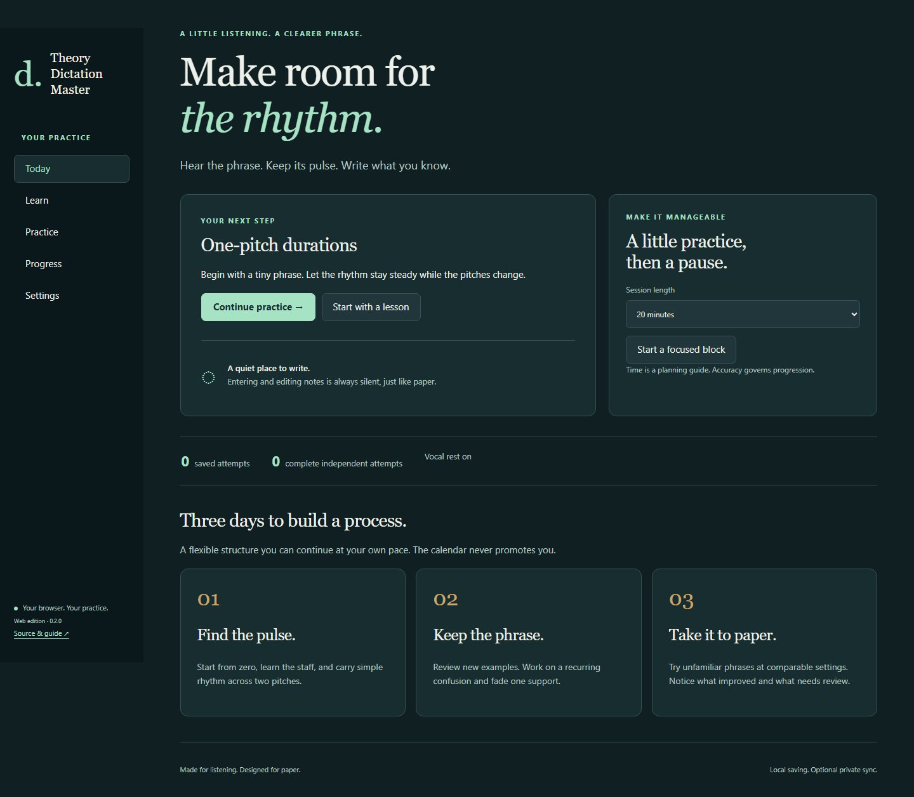
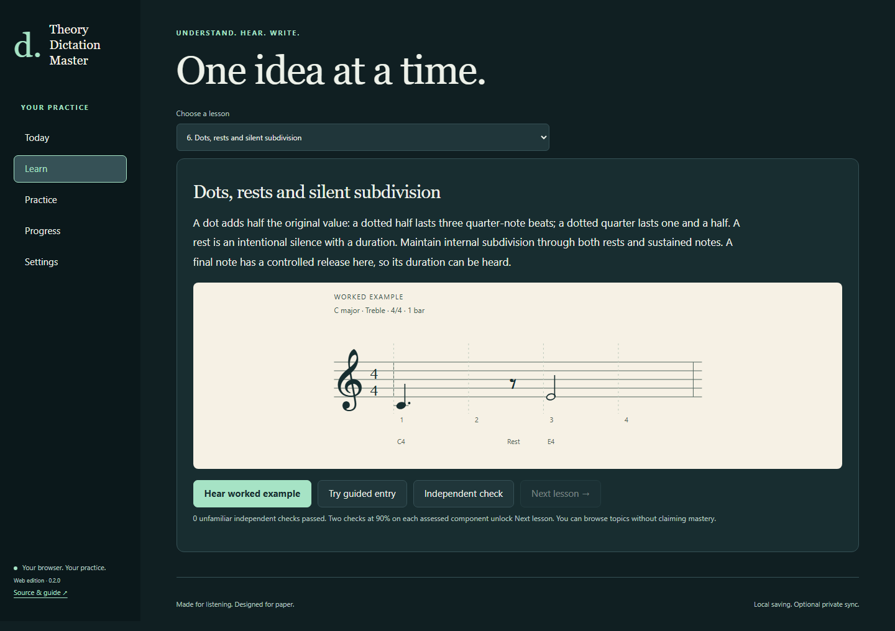
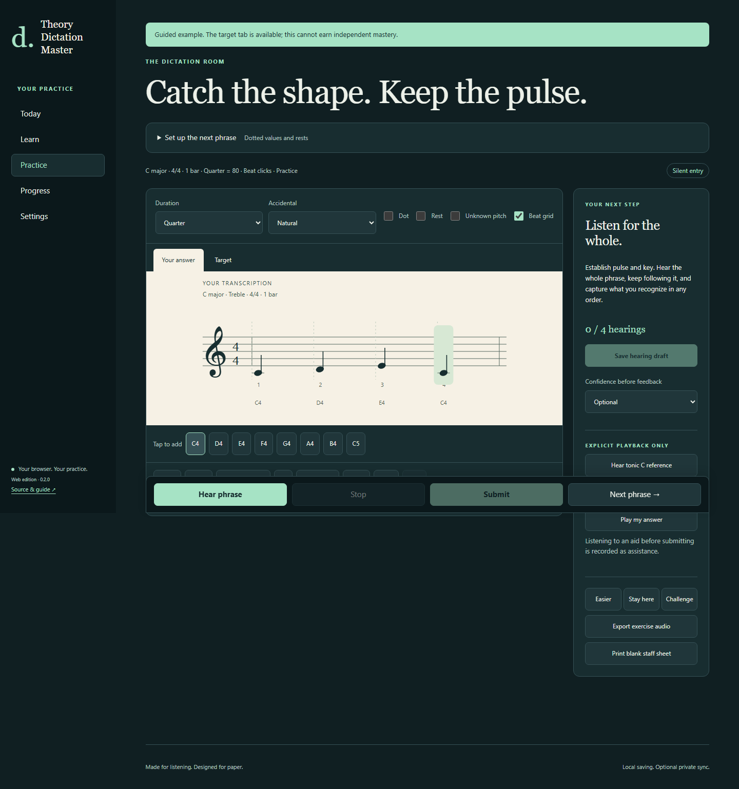
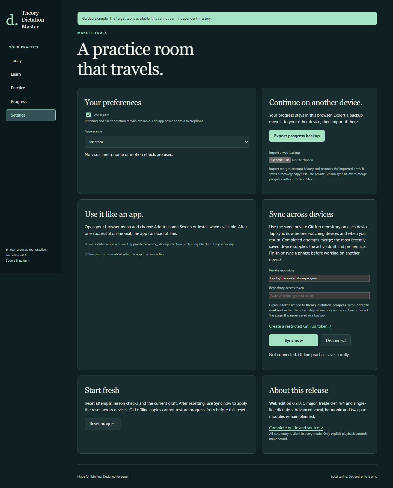
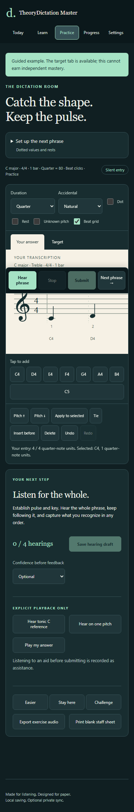

<div align="center">

# Theory Dictation Master

### Hear the phrase. Keep its pulse. Write it silently.

[](https://github.com/Eipckz/theory-dictation-master/actions/workflows/pages.yml)
[](https://github.com/Eipckz/theory-dictation-master/releases/latest)

**[OPEN THE APP](https://eipckz.github.io/theory-dictation-master/)** · **[Latest web release](https://github.com/Eipckz/theory-dictation-master/releases/latest)** · **[Sync setup](#sync-between-devices)**

Practice melodic dictation on a computer, tablet, or phone. Nothing to install. Note entry is always silent, like writing on paper.



</div>

## Start here

1. Open the app link above in a modern browser with JavaScript and Web Audio.
2. Choose **Learn**. Hear a worked example, read the short explanation, then try guided entry.
3. In **Practice**, choose a duration and tap a pitch button or the staff to add a note. Select a note to edit it. Adding, selecting, dragging, changing duration, tying, deleting and undoing notes never play sound.
4. Tap **Hear phrase** when ready. Sound only starts from a playback button. Take your time entering what you retained.
5. Choose **Save hearing draft** before another hearing. The draft preserves what you knew at that point.
6. **Submit** compares rhythm, durations/rests, and pitch separately. Open **Target** only after submitting an unfamiliar exercise.
7. Choose **Next phrase** for new evidence. **Settings** contains backups, private sync, and a reset button.

Your first profile starts at the beginning with vocal rest enabled and no attempts. This app never uses your microphone.

## What it trains

Following pitches can distract you from rhythm. The progression carries simple rhythmic patterns through changing pitches before increasing rhythmic complexity:

| Target | Listening task |
| --- | --- |
| One-pitch durations | Hear attacks, sustain and silence relative to a steady beat |
| Two-pitch bridge | Keep the rhythm while the melody moves between two notes |
| Three-pitch integration | Retain contour and duration together |
| Eighth-note division | Recognize subdivisions inside the beat |
| Wider landmarks | Use pitch landmarks while following the whole phrase |
| Dots and rests | Distinguish sustain, silence and the next attack |
| Sixteenth cells | Keep beat grouping while hearing shorter patterns |

Nine short lessons include orientation, pulse, the pitch/rhythm bridge, subdivisions, dots/rests, ties and paper transfer. Lesson examples are explicitly guided and cannot earn independent mastery. The orientation unlocks after adding a note and using Undo. Later Next lesson buttons require two unfamiliar passing checks; the lesson selector lets you revisit material freely.

**Three days is a practice structure, not a mastery promise.** Day one establishes pulse and a small pitched vocabulary. Day two integrates them and fades support. Day three tries unfamiliar paper and no-click conditions. Continue at your own pace afterward. Session timers suggest a break after submission; elapsed time never awards progress.



## Silent notation editor



- Choose whole, half, quarter, eighth, sixteenth, or unknown duration.
- Set dot, rest, unknown pitch, natural, sharp or flat before adding a note.
- Click/tap blank staff space to append at that pitch, or use the large pitch buttons.
- Click an entered note to select it. Drag vertically or use Pitch up/down to move it silently.
- Change settings and use **Apply to selected** to change its duration, accidental or rest state.
- **Insert before** inserts ahead of the selected note. Turn it off to append again.
- **Tie** joins to a following adjacent note of the same pitch. Invalid ties are flagged at grading.
- **Undo / Redo** keeps up to 100 edits in the current browser session. Drafts and notes survive reload; the undo stack does not.
- The staff grows horizontally and scrolls inside the paper area. It does not show empty slots matching the hidden target.
- Unknown pitches/durations are explicit unfinished sketches. Resolve them for an integrated pass, except pitch is not required in rhythm-only assessment.

### Keyboard controls

Focus the staff first. C, D, E, F, G, A, B append notes in octave 4. Space appends at C4. Arrow left/right selects an entry; up/down changes pitch. T toggles a tie. Delete/Backspace removes a selected event. Ctrl/Cmd+Z undoes; Ctrl/Cmd+Shift+Z or Ctrl+Y redoes. Touch buttons provide the same basic operations on mobile.

### Playback

**Hear phrase**, **Hear tonic C reference**, **Hear on one pitch**, **Play my answer**, and **Hear worked example** are explicit sound controls. No editor operation calls audio playback. Assessment and paper modes disable answer audition and depitched aids before submission. Tonic reference use is recorded as assistance. Press **Stop** to interrupt. Leaving the page or switching away during target playback also stops it and marks the hearing assisted.

Hearing allowances apply before submission. Replays after feedback are review. An interrupted or failed hearing is consumed, cannot count as valid independent audio evidence, and requires a saved draft before continuing. Start a new phrase after an audio failure.

| Pulse support | What you hear |
| --- | --- |
| Subdivision | Four-beat count-in, then eighth-note clicks |
| Beat | Count-in, then quarter-note clicks |
| Dropout | Count-in, two beats of clicks, then your internal pulse |
| Count-in only | Four clicks, then the phrase alone |
| No clicks | Phrase without a count-in or continuing metronome |

There is no animated beat cursor. The optional beat grid is static and disabled in assessments/paper mode. Generated audio uses a local harmonic synthesizer; no samples, microphone, streaming service or API key is needed for listening.

## Assessment and feedback

| Measure | Meaning |
| --- | --- |
| Attack timing | Match between target and entered sound onsets |
| Durations / rests | Matching onset, duration and rest segments |
| Pitch sequence | Pitch edit distance, assessed independently of rhythm |
| Barline grouping | Whether your written durations stay within their bars |
| Integrated | Lowest assessed listening component, or zero for an invalid/incomplete answer |

Valid ties merge into one sustained sound for listening comparison. Feedback identifies missing/extra attacks and rhythm-versus-pitch difficulties. Repeated pitches can produce ambiguous alignments; the app says so rather than inventing a precise diagnosis.

Independent evidence excludes guided examples, aids, interrupted/invalid audio, paper self-checks, and imported-file evidence. Repeated melodies count once per comparison group. Automatic advancement requires two blocks of eight comparable unfamiliar items, with seven passes in each and at least 90% on every assessed listening component. Comparability includes target, BPM, bars, mode, support, hearing allowance, and rhythm-only status. Mixed-condition history is descriptive, not proof of improvement.

Exploratory **Easier / Stay here / Challenge** choices are available without awarding confirmed levels. A rhythm-focused follow-up can retain a difficult rhythm while changing pitches; this is labeled assisted. The web release does not implement a calibrated spaced-repetition model or infer mastery from time spent.

## Paper and classroom practice

Select **Paper** in the next-phrase setup, then **Next phrase**. Print a blank staff sheet using the browser print dialog, or use your own manuscript paper. Hear the phrase under the selected allowance and write quietly.

Choose **Enter my paper answer** to transcribe your handwriting for grading. Alternatively **Reveal for self-check** displays the target without pretending to grade handwriting. Self-checks cannot earn independent mastery. A separate printable answer key is available after submission. **Export exercise audio** downloads a WAV and marks pre-submission work assisted because outside replays cannot be counted.

## Sync between devices

Progress saves locally first. **Sync now** uploads and downloads progress through GitHub's API. It is an explicit action, not continuous background sync.

The private repository [Eipckz/theory-dictation-progress](https://github.com/Eipckz/theory-dictation-progress) is configured for the owner's progress. Other users can create their own empty private repository and enter its owner/name.

### One-time credential setup on each device

1. In GitHub, open [Create a fine-grained personal access token](https://github.com/settings/personal-access-tokens/new?name=Dictation%20progress&contents=write).
2. Select your account as resource owner. Choose **Only select repositories**, then select **theory-dictation-progress**. Choose an expiration date you can maintain.
3. Under repository permissions, grant **Contents: Read and write**. Do not grant access to other repositories for this app.
4. Generate the token. Copy it directly into **Settings > Repository access token** in the app. Do not put it into an issue, public file, chat, or progress backup.
5. Tap **Sync now**. The status should show a success time. Repeat on your other device with a token restricted to the same private repository.

The token is kept only in page memory. Closing/reloading the page or pressing Disconnect removes it; paste it again to sync. You may use separate restricted tokens for each device and revoke them independently in GitHub. The app will refuse public repositories. Progress is stored as `progress.json` in the private repository, visible to its collaborators and retained in Git history. It is not end-to-end encrypted.

### Everyday workflow and conflicts

- Tap **Sync now before switching devices**.
- On the next device, open the app and tap **Sync now before editing**.
- Completed attempts are merged by ID. Lesson passes are merged without duplicate entries.
- The most recently changed device supplies the active draft and preferences. Only one active draft is retained. Sync or finish a phrase before working elsewhere. Keep device clocks accurate.
- Concurrent uploads retry using GitHub's file SHA, so a changed cloud file is fetched again before writing.
- Offline work is saved locally. A network/token/permission error leaves that work intact; retry when connected.
- Keep occasional exported backups. Sync is not a substitute for archival backups.

### Resetting progress

**Settings > Reset progress** clears this browser's attempts, lesson checks and draft after a confirmation. Then **Sync now** to reset the cloud copy too. Other devices receive the reset on their next sync; an old offline copy cannot restore pre-reset progress. A reset does not erase historical Git commits. Browser credentials are not part of progress.



## Backups, installation and offline use

**Export progress backup** saves a JSON file. **Import a web backup** validates it, merges its attempts, and resumes its active draft. File-imported attempts stay visible but cannot silently manufacture new mastery. A pre-import recovery copy is available in Settings. Files from the old desktop SQLite app are not compatible with web JSON backups.

After an online visit finishes caching, the service worker can reload the app offline. Open your browser menu and choose **Install** or **Add to Home Screen** when supported. The site does not need a Windows executable. Browser storage is specific to the browser and device; private browsing, storage eviction and clearing site data can remove it. Sync requires an internet connection. If the browser blocks sound, enable device/browser sound and tap an explicit playback button again.

<details><summary>Phone view</summary>



</details>

## Current scope and limits

- Web v0.2.0: single-line dictation in C major, treble clef, 4/4, 1 to 4 bars, 40 to 160 BPM.
- Generated lessons focus on a small diatonic range. The editor supports a wider range and accidentals.
- Exact timing uses 12 integer ticks per quarter note. Dotted eighths and longer dotted values work; dotted sixteenths, tuplets and irregular meters are not implemented.
- Barline grouping feedback is limited. It does not assess every engraving convention or enharmonic spelling.
- Harmony/chord entry, two-part dictation, sing-back, microphone analysis, MusicXML import and full course customization remain planned. This release does not pretend to contain them.
- Actual loudspeaker quality and physical iPhone/iPad hardware still depend on your device. Automated browser checks verify scheduling and audio startup, not your speaker volume or how it sounds to your ear.
- The browser app and historical Python app have independent storage and implementations. The latest release is the web package. The [v0.1.0 Windows EXE](https://github.com/Eipckz/theory-dictation-master/releases/tag/v0.1.0) remains available as an archive.

## Screenshots and earlier walkthrough media

The screenshots above show the actual web app with demonstration entries, not personal learning results. The earlier desktop edition's [animated walkthrough](docs/media/walkthrough.gif), [video and EXE release](https://github.com/Eipckz/theory-dictation-master/releases/tag/v0.1.0), and [desktop guide](docs/DESKTOP.md) are retained for reference. Their layout differs from this web release.

## Development and deployment

```sh
npm ci
npm test
npx playwright install chromium webkit
npx playwright test
npm run serve
```

Open http://127.0.0.1:4173. No framework build is needed: `web/` is the deployable site. Serve over HTTP locally or HTTPS remotely; opening `index.html` as a `file:` URL does not support its module/service-worker workflow. Python tests and desktop development remain in the legacy source tree.

| Path | Purpose |
| --- | --- |
| `web/domain.js` | Exact score time, generator, grading, evidence rules |
| `web/staff.js` | SVG notation using Bravura glyphs |
| `web/audio.js` | PCM synthesis, WAV export, explicit Web Audio playback |
| `web/store.js` | Local backup validation and import |
| `web/sync.js` | Private GitHub storage, merge and reset handling |
| `web/app.js` | Interface, lessons, drafts, silent editing and settings |
| `web/sw.js` | Offline shell caching |
| `web-tests/` | Determinism, grading, timing, sync and validation tests |
| `browser-tests/` | Real browser entry, playback, paper, persistence, reset and sync UI |

Pushes to `main` run tests, package `web/`, and deploy GitHub Pages through Actions. Tags publish a web ZIP plus SHA-256 checksum. Changes can be made from any device using the GitHub web editor or Codespaces; no copy must remain on the original computer. Keep `sw.js` cache version current when changing offline assets.

The test suite covers 700 generated phrases, rhythm/pitch separation, ties, unknowns, malformed backups, repeated-evidence exclusion, sync conflicts/reset generations, interrupted audio unlock, and real browser workflows. Windows local tests use Chromium and a mobile viewport. GitHub Pages deployment additionally runs WebKit on Linux because the bundled Windows WebKit does not provide Web Audio. Mobile emulation is not physical-device certification. Offline reload is verified in Chromium; the Playwright WebKit offline emulator fails navigation internally, so Safari offline behavior remains unverified. Live private-repository sync was checked for a cross-device round trip and reset protection; UI network failure and credential handling are also tested with controlled API responses.

## Licensing and reference

GPL-3.0, see [LICENSE](LICENSE). The UI and teaching progression were developed from the separately preserved [Music Theory Master](https://github.com/Eipckz/music-theory-master) reference. Its original application and progress database are untouched. See the [desktop guide](docs/DESKTOP.md) for the reference revision and original build notes.

Bravura is distributed under the SIL Open Font License, bundled in [web/fonts/OFL.txt](web/fonts/OFL.txt). Music glyphs are local, so notation renders without a font CDN. GitHub tokens are never bundled in the public repository, release, site or backups.
