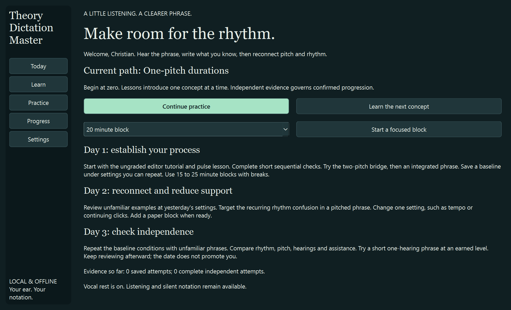
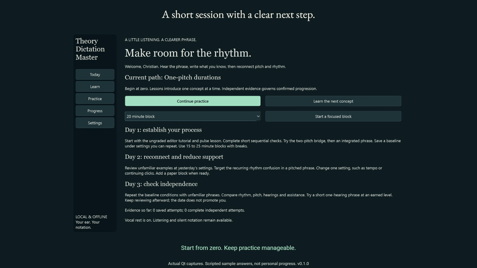
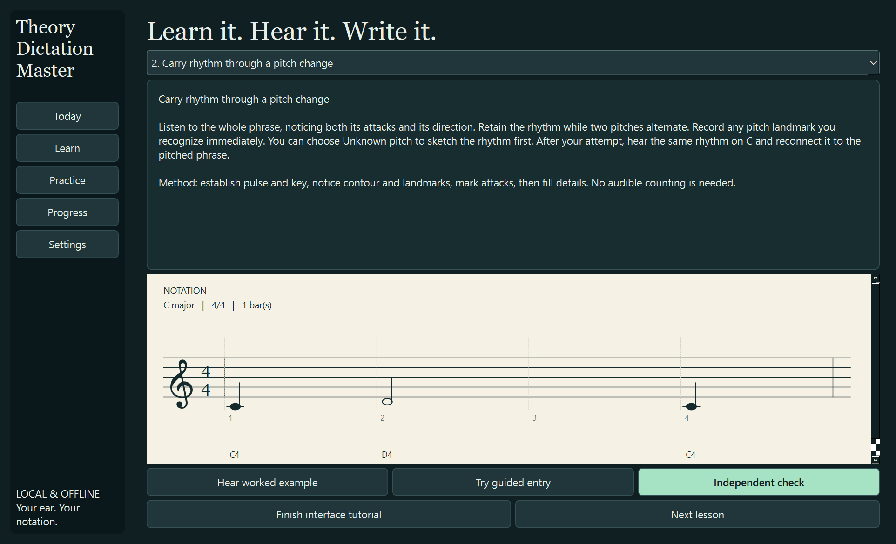
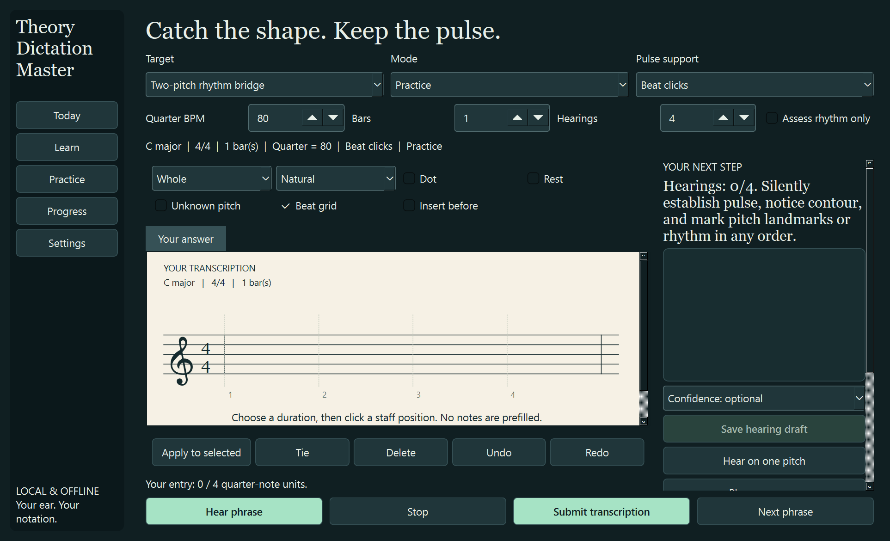
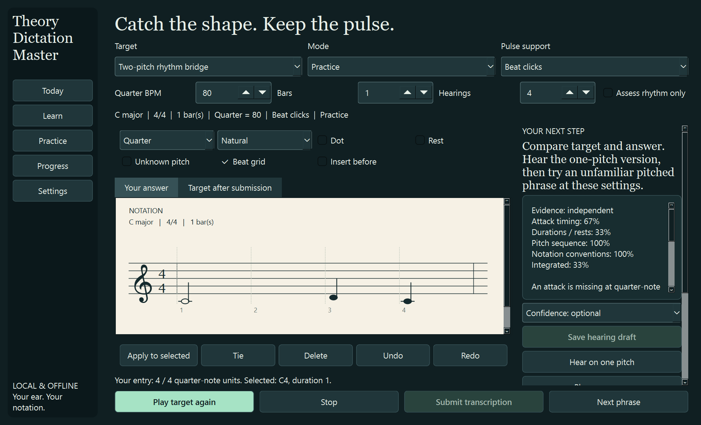
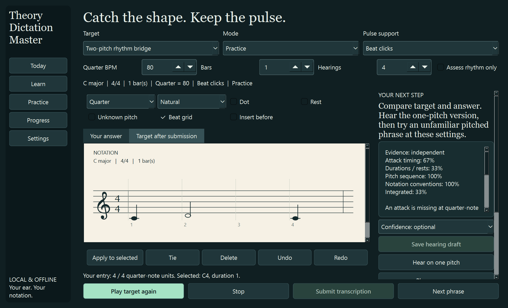
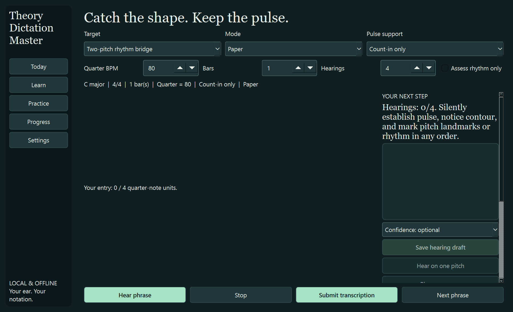
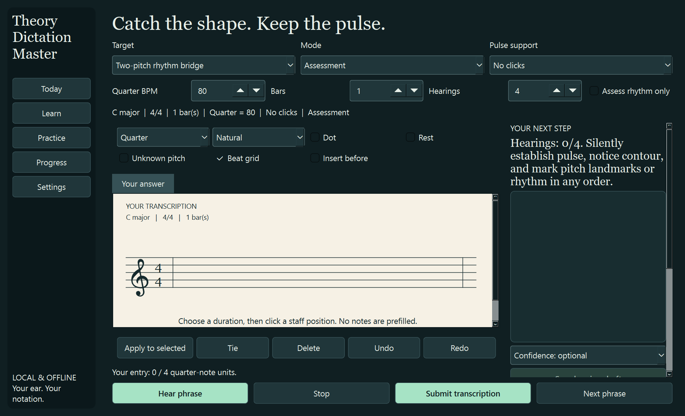

<div align="center">

# Theory Dictation Master

### Hear the phrase. Keep its rhythm. Put both on the staff.

[](https://github.com/Eipckz/theory-dictation-master/actions/workflows/ci.yml)
[](https://github.com/Eipckz/theory-dictation-master/releases/latest)
[](LICENSE)

An offline Windows application for learning to transcribe **rhythm inside pitched melodies**, with clickable notation and separate pitch and rhythm feedback.

**[Download the Windows EXE](https://github.com/Eipckz/theory-dictation-master/releases/download/v0.1.0/TheoryDictationMaster.exe)** · **[All release files](https://github.com/Eipckz/theory-dictation-master/releases/latest)** · **[First five minutes](#your-first-five-minutes)**



</div>

## What this application is for

Sometimes you can hear an isolated rhythm and recognize pitches in a key, yet following a melody's pitches makes its rhythm disappear from attention. This app targets that bridge:

**One-pitch rhythm → the same rhythmic work across two or three pitches → integrated transcription → reduced pulse support and paper practice.**

You place actual notes and rests on a staff. You can sketch a rhythm with unknown pitches, or record a pitch while leaving its duration uncertain. After submission, the app reports what happened to the rhythm independently of the pitch sequence. Accurate pitches cannot hide weak rhythm in the integrated result.

This is **v0.1.0, a working single-line core**. It is not a promise of mastery in three days or a finished implementation of every planned advanced module. See [what works and what comes next](docs/ROADMAP.md).

## See it in use



**[Watch or download the full-resolution walkthrough](https://github.com/Eipckz/theory-dictation-master/releases/download/v0.1.0/TheoryDictationMaster-walkthrough.mp4).** The 28-second silent walkthrough shows actual Qt captures. Its answers and completed hearing are scripted demonstration data, not a user's learning results. The full-resolution pictures below are easier to inspect than the compact GIF.

<details>
<summary><strong>Learning, entry, feedback and paper screenshots</strong></summary>

### A lesson reconnects rhythm to pitches



### Begin with an empty staff



### Separate pitch and rhythm feedback

The demonstration below enters the correct pitch sequence with different durations. Notice that pitch credit is preserved while rhythm credit falls.



### Compare the target after submission



### Paper mode



### No-click assessment



</details>

## Download and launch

### Windows x64

1. Download **[TheoryDictationMaster.exe](https://github.com/Eipckz/theory-dictation-master/releases/download/v0.1.0/TheoryDictationMaster.exe)**.
2. Put it in a convenient application folder.
3. Double-click it. Python and the required runtime libraries are bundled.
4. Start with the **Learn** screen that opens on first launch.

No account, API key, subscription, microphone, MIDI keyboard or internet connection is required for the core application. The single-file executable extracts its bundled libraries to a temporary directory at startup, which can make its first launch take a few seconds. It is an unsigned early release; Windows may show an unfamiliar-app prompt. Download from this repository's release page and use the matching checksum if you want to verify the file.

```powershell
Get-FileHash .\TheoryDictationMaster.exe -Algorithm SHA256
```

Compare that hash with the release's `TheoryDictationMaster.exe.sha256`. Updates replace the EXE; progress is stored separately. There is no installer or automatic updater in this release.

### Your existing Music Theory Master is separate

This application has a separate executable, source tree, app identity and database. It does not modify, replace, import or share Music Theory Master's live progress. The visual reference was [Music Theory Master](https://github.com/Eipckz/music-theory-master), inspected at revision `b880c55086f8822cb0ea70897e750b38180c1800`. [Reference audit and architecture](docs/ARCHITECTURE.md).

## Your first five minutes

### 1. Learn the editor without being graded

Open **Learn → 0. First marks on the staff**. Read the brief explanation and press **Hear worked example**. Then choose **Try guided entry**.

- Select **Quarter** and click a staff position.
- Select an existing note and press Up or Down to move it.
- Press **Undo** to reverse an entry or edit.
- Return to Learn and press **Finish interface tutorial**.

The tutorial checks that you entered something and used Undo. It does not measure your ear or award independent mastery.

### 2. Establish the pulse

Use **Next lesson** for the pulse lesson. Hear the worked example, then try guided entry. With a quarter-note beat, a quarter lasts one beat and a half lasts two. A rest occupies time silently. Keep counts and any conducting internal or silent.

Choose **Independent check** when ready. For each lesson after the tutorial, two unfamiliar independent checks with at least 90% on every assessed component unlock the Next lesson button. You can browse lesson topics manually; browsing is not a mastery claim.

### 3. Hear, write, save a draft

In Practice:

1. Check the key, meter, bars, tempo and pulse support shown above the staff.
2. Use **Hear tonic C reference** if useful. The reference is a permitted cue.
3. Press **Hear phrase**.
4. After playback, take the writing time you need. Enter any rhythm or pitch landmarks you retained.
5. Press **Save hearing draft**. This enables the next hearing, subject to the displayed allowance.
6. Continue listening and revising, or choose a confidence rating and submit.

Writing speed is not scored. A draft captures what you entered after a hearing; it does not claim to measure everything you recognized mentally during that hearing. Stopping playback consumes that exposure and marks the attempt assisted.

### 4. Read the components

Press **Submit transcription**. Read the first useful correction. Compare **Your answer** with **Target after submission**. Play the target, your answer and the one-pitch version to isolate what changed. Use **Targeted follow-up** to practice the same rhythm with different pitches, then **Next phrase** for unfamiliar practice.

## Staff entry and correction

The primary editor is sequential: each click in empty staff space appends an event. Click an existing note to select it. Notes are never preallocated according to the answer key.

| Control | What it does |
|---|---|
| Whole / Half / Quarter / Eighth / Sixteenth | Sets the next event's duration |
| Dot | Adds half the selected base duration |
| Natural / Sharp / Flat | Sets the written accidental |
| Rest | Adds intentional silence with the chosen duration |
| Unknown pitch | Keeps pitch explicitly incomplete while you capture rhythm |
| Unknown duration | Keeps duration explicitly incomplete while you capture pitch |
| Apply to selected | Applies duration, dot, rest and accidental settings to a selected event |
| Drag a selected note vertically | Changes its pitch |
| Insert before | Places the next event before the selected note |
| Tie | Toggles a tie from the selected note to the next note |
| Delete | Removes the selected event |
| Undo / Redo | Restores previous editor states |
| Beat grid | Displays a neutral beat guide in Practice only |

A valid tie needs a following note of the same sounding pitch. A half note and two tied quarters can receive equivalent sound credit. Two untied quarters contain an extra attack.

Unknown durations use provisional spacing, but they do not silently become one-beat answers. Duration changes preserve all entered events, even if they overfill the phrase. The entry line shows your total against the stated phrase length. Dense notation scrolls horizontally.

### Keyboard alternatives

Click or Tab into the staff first.

| Key | Action |
|---|---|
| A through G | Append that natural note in octave 4 with the selected duration |
| Space | Append middle C with the selected duration |
| Left / Right | Select the preceding or following event |
| Up / Down | Move the selected pitch by one staff step |
| R | Append a rest |
| T | Toggle tie to the next note |
| Delete / Backspace | Delete the selected event |
| Ctrl+Z / Ctrl+Y | Undo / redo |

The current grid is a visual scaffold, not a free-position beat-grid editor. Tuplets, multiple voices, pickups and polished cross-bar engraving are not yet available.

## Practice, assessment and paper

| Mode | Before submission | How it counts |
|---|---|---|
| Practice | Beat grid is optional. Answer playback and one-pitch hints are available. | Unassisted complete work can count independently. Using assistance is logged. |
| Assessment | Grid, answer playback, target notation and one-pitch hints are unavailable. | Completed independent evidence under the stated conditions. |
| Paper | Entry starts hidden. Listen and write on paper. | Enter the answer before revealing it for scoring, or choose a labeled self-check. |

Changes to level, mode, support, BPM, bars or hearing allowance apply to **the next phrase**. The current phrase retains its original conditions. A new phrase abandons any unfinished entered/heard attempt while keeping its record.

### Metronome support

- **Subdivision clicks:** two clicks per quarter-note beat in the visible 4/4 course.
- **Beat clicks:** continuing quarter-note clicks.
- **Dropout:** count-in, then clicks for the beginning of the phrase only.
- **Count-in only:** a measure of clicks before the phrase; no continuing metronome.
- **No clicks:** no count-in or ongoing pulse; the stated BPM supplies the intended tempo context.

There are no bouncing cursors, beat flashes, timed highlights or scrolling playheads. Turning off clicks does not leave a hidden visual metronome. The neutral grid is also disabled in assessment and paper modes.

### Paper workflow

1. Choose Paper and start a new phrase.
2. Prepare key, meter and barlines on paper.
3. Listen, write and save each hearing draft to unlock the next hearing. The app cannot see your handwriting.
4. Choose **Enter paper answer** to transcribe your paper work into the editor before submission.
5. Alternatively, choose **Reveal for paper self-check**. This records a self-check, with no automatic handwriting score or mastery credit.

**Export audio + blank sheet** produces a WAV and a blank PDF with the same neutral ID. The separate answer-key export becomes available only after submission/reveal. Exported listening is unobserved, so exporting before submission marks the attempt assisted. Playback rounds and writing intervals are manually controlled in this release.

## How feedback works

| Result | Meaning |
|---|---|
| Attack timing | Did your notes begin at the correct exact score-time positions? |
| Durations / rests | Did your sound and silence segments have the correct positions and lengths? |
| Pitch sequence | How many pitch insertions, omissions or substitutions separate your sequence from the target? |
| Notation conventions | A separate, coarse check of spelling and barline grouping |
| Integrated | The weakest assessed listening component |

Pitch grading uses sequence alignment, so one omission does not automatically mark every subsequent pitch wrong. Rhythm grading ignores the pitches. Equivalent valid ties are merged for sound comparison. Ambiguous pitch alignments are identified. Feedback describes score time in quarter-note units from the beginning, with zero as the first onset.

**Assess rhythm only** omits pitch from the assessment. Unknown pitches are accepted in a complete rhythm-only answer. Unknown durations remain incomplete. Audio failure does not count as a wrong answer or an independent success.

[Exact formulas, equivalent notation and adaptation rules](docs/GRADING.md).

## Learning path and three-day use

The course starts with staff orientation and pulse. Practice then progresses through one-pitch durations, the two-pitch bridge, three-pitch integration, eighth-note division, wider pitch landmarks, dotted values/rests and sixteenth cells. Each level transition primarily changes pitch or rhythm vocabulary. Tempo, phrase length and pulse support remain separate controls.

The Today page offers flexible **15, 20 or 25 minute blocks**, plus an **8-minute low-energy option**. A planned block is a reminder, not a time-based promotion rule.

- **Day 1:** learn the interface and pulse from zero; identify the rhythm-with-pitches bottleneck; try a small integrated phrase.
- **Day 2:** review unfamiliar material at comparable settings, target a recurring rhythm confusion, and reduce one support when ready.
- **Day 3:** repeat comparable conditions, try earned no-click or paper work, and identify the next review need.

Rhythm-first is a temporary scaffold. You can capture an obvious pitch immediately, retain a contour, or work from the whole phrase. No singing or audible counting is required. **Vocal rest is on initially**, and no microphone is opened by this core release.

### What counts as progress

Confirmed advancement initially requires two blocks of eight unfamiliar independent exercises, with at least seven passing in each block and every assessed pitch/rhythm component at least 90%. This is an adjustable engineering heuristic, not a scientifically validated threshold. The confirmed level advances one step.

Assisted work is useful practice, but cannot establish independent mastery. Repeated target content cannot multiply mastery credit. Easier, Stay here and Challenge let you choose exploratory practice. The Progress page shows evidence counts, recent descriptive component results and saved first-draft comparisons.

Current review reminders are set roughly 20 minutes after a submission. Full later-day scheduling, retained-learning labels, eight distinct skill estimators and matched benchmark charts are planned. The current app does not claim those features are finished.

## Saved progress, backup and portable use

Default Windows data location:

```text
%LOCALAPPDATA%\TheoryDictationMaster\progress.sqlite3
```

The active answer, hearing drafts and settings are saved locally. Use **Settings → Back up progress** to create a SQLite backup. Restore checks the backup and creates a safety backup of the previous data first. Restart after restoration to refresh all profile preferences. **Progress → Export complete evidence JSON** exports the detailed attempt records.

For explicit portable data:

```powershell
.\TheoryDictationMaster.exe --data-dir "D:\DictationPractice\data"
```

Choose a reliable local directory. The app has no synchronization layer or support for multiple running copies writing the same database. To uninstall, delete the EXE. Keep the data folder if you want to retain progress.

## Troubleshooting

**No sound:** check the Windows output device and volume, then try Hear tonic C reference. The application uses the default output device. An audio exception is shown and invalidates independent credit for that attempt. Start a new phrase after correcting the device problem. A successful output API call does not prove that speakers were audible.

**Hear phrase is disabled:** finish playback, enter what you retained and press Save hearing draft. If the allowed hearings are used, submit or start another phrase.

**The notes do not add up:** select an event and apply its intended duration; check dots and rests. Nothing is silently filled from the target. Use Undo if an edit was accidental.

**A note looks wrong:** confirm duration and accidental, then use Apply to selected. Small values are beamed within beats. Longer and dense phrases may require horizontal scrolling.

**The target tab is missing:** it becomes available after submission, or during a clearly assisted worked example.

**The window feels crowded:** enlarge it or scroll the staff/coaching panel. Screenshots were inspected at normal and 150% display scaling, including a smaller window. Light appearance is available in Settings. Comprehensive screen-reader auditing is still pending.

**Progress cannot open:** the app leaves the original file in place. Use a separate `--data-dir` to launch, then restore a known good backup. Recoverable UI errors are written to `error.log` in the data directory.

## Build or run from source

Python 3.14 x64 was used for the Windows build. Development dependency installation needs internet access; the completed runtime does not.

```powershell
git clone https://github.com/Eipckz/theory-dictation-master.git
cd theory-dictation-master
python -m venv .venv
.\.venv\Scripts\python.exe -m pip install -r requirements.txt
.\.venv\Scripts\python.exe run.py
```

Run tests and the interactive Qt smoke test with an isolated temporary data folder:

```powershell
.\.venv\Scripts\python.exe -m pip install -r requirements-dev.txt
.\.venv\Scripts\python.exe -m pytest -q
.\.venv\Scripts\python.exe run.py --self-test
```

Build the standalone Windows EXE:

```powershell
.\build-windows.ps1
```

The result is `dist\TheoryDictationMaster.exe`. GitHub Actions runs tests on pushes and can build/attach an executable for version tags. No cloud service is part of the application runtime.

## Verification and honest limits

- 39 automated tests cover 2,100 seeded generation cases, fixed rhythm arithmetic, independent grading, ties, rests, tempo units, audio buffers, persistence, backup recovery and GUI policy.
- A packaged fresh-data smoke test exercises Qt mouse entry, duration editing, undo/redo, grading, idempotence, restart persistence and exports.
- Real screenshots were inspected. The output driver completed a representative playback without reporting an error.
- The builder did **not** independently listen to the audio, validate microphone recording, prove learning effectiveness or complete a full accessibility audit.

[Validation record](docs/VALIDATION.md) · [Architecture](docs/ARCHITECTURE.md) · [Grading](docs/GRADING.md) · [Roadmap](docs/ROADMAP.md)

## Contributing and license

Bug reports should include the app version, what happened, the expected result and, when useful, an exported neutral exercise/attempt record. Review exports before sharing: they can contain your answers and confidence history. Do not upload your entire private progress database by default.

The application is GPL-3.0-only. [License](LICENSE) · [Dependency and reference notices](THIRD-PARTY-NOTICES.md).


